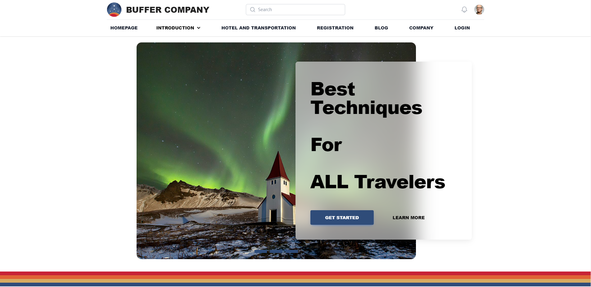

# Info6150-midterm-project
## Buffer Travel Company 
Buffer Company is a premier travel company dedicated to providing exceptional experiences for travelers around the world. With a team of passionate experts, we specialize in crafting unforgettable journeys that cater to the unique interests and preferences of our clients.

At Buffer Company, we believe that travel is not just about visiting new places; it's about creating lasting memories and exploring the world in a way that resonates with your soul. Whether you're an adventurous explorer, a culture enthusiast, or simply seeking relaxation, we have the perfect itinerary for you.

## Midterm Assignment
This is actually a midterm **individual** assignment for Neu Info 6150 on completing a travel website with mostly complete functionality. I implemented it as a project, analyzing the products of competing companies, referring to their web apps, and finally implementing it. 

The project was divided into four main steps:

* In the first stage, I set up the basic company concept and art style, and split up the competitor's web page functions, and used kanban to write user stories for each content, and set up the requirements; 

* In the second stage, according to my own ability and the requirements of the project, I realized the functions of the web app that I could do with the guidance of the kanban in the first stage, using **Html, Tailwind Css, and Javascript** to realize the functions of the web app, which I could do. Tailwind Css and Javascript to write the front-end code, and reserved interfaces for the back-end development, and upload it to github for the project to go live; 

* Stage 3, complete most of the content development and test it to find the unreasonable design logic or bugs in the webpage and fix it; 

* Stage 4, to create slide and other presentation content for offline demonstration.

## Art Style
Since I'm a big fan of Bethesda's new Starry Night, I decided to use the art style proposed for this game Nasa Punk.

## Some Of The Displays

## Insights From Midterm
The key to all the js code is to get the current state, and modify certain class attributes in the html code as needed to achieve the purpose.

Again, picking a css wrapper framework saves a lot of time in terms of work.

## Return Top
Get the current button flag, and use the window function to detect the page scrolling distance, if more than a certain range, then display the button, and add a click event for the button so that it can reach the position of the top:0.

## Slide Picture
The most difficult feature for me to implement had to consider not only the interaction with the css in the HERO section of the html, but also the logic of the sliding js. 

First, after the page is loaded, get all the rotating image elements by querySelectorAll() method, record the number of images imageCount, and set the index of the current image subscript to 0. 

Then, create a loop to create a number of bottom indicator elements equal to the number of images, and add them to the . carousel .bottom element and add a click event handler, setIndex(), for each indicator. 

Next, a createAuto() function is defined to create a timer to automatically scroll the image every 6 seconds. 

Then, the refresh() function is defined to calculate the image to be displayed based on the current image subscript, and then move the image left by a certain distance to realize the effect of switching images. 

Next, a refreshWrapper() function is defined to encapsulate the other functions, so that the refresh() function is executed once after each function is executed, thus allowing the page to be updated on-the-fly.

